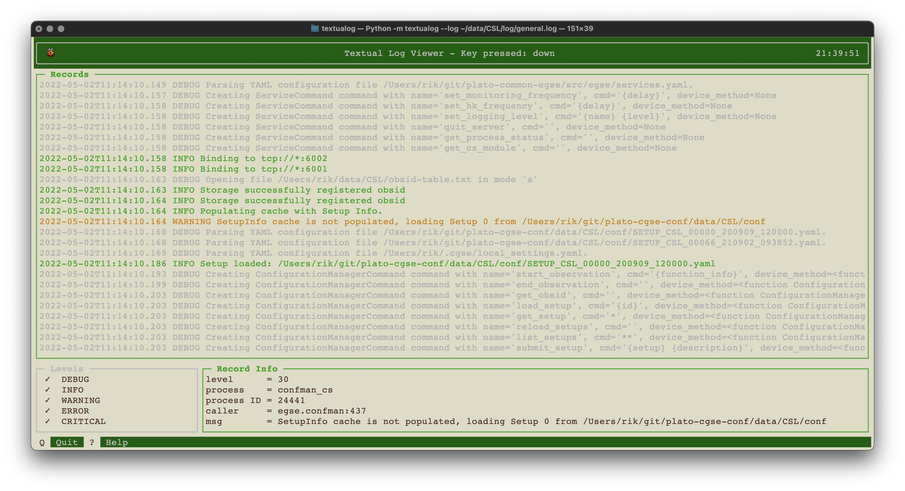

# Textualog

Display, filter and search logging messages in the terminal.



This project is powered by [rich](https://github.com/Textualize/rich) and [textual](https://github.com/Textualize/textual).

Some of the ideas and code in this project are based on:

* [kaskade](https://github.com/sauljabin/kaskade)
* textual example code, e.g. code_viewer
* [cutelog](https://github.com/busimus/cutelog/)

## Installation

The easiest way to install the package is by running the `pip` command in the Python virtual environment of your project:
```
$ python -m pip install [--upgrade] textualog
```

## Usage

The `textualog` app should have been installed in your environment, then run the following command:
```
$ textualog --log <path to the log file>
```
In the `examples` directory of this project, you can find an example log file to inspect and play with. 

The main view is divided in three panels, (1) a _Records_ panel that displays all the logging records in a colored view, (2) a _Record Info_ panel that displays more details about the selected logging message (a message can be selected by a mouse click), and (3) a _Levels_ panel that displays the standard logging levels. Logging levels can be switched on or off with a key press, d=debug, i=info, w=warning, e=error, c=critical. When you click inside the _Record Info_ panel, the main view will change in a _Record Details_ view that displays all information associated with the selected logging message. This view is mainly used when the logging message has extra multi-line information attached, and depending on the amount of information, this view is scrollable. When the selected logging message contains extra information, the _Record Info_ panel will have an asterisk in the title.  Use the Escape key to return to the main view.

The app can be terminated with the 'q' key or by pressing CTRL-C. If you need a little help on the keyboard shortcuts, press the '?' key to present the _Info Help_ panel on the right side of the terminal. Also here use the Escape key to hide the help panel again.

Pressing the 'n' key will slide in a _Namespaces_ panel on the left side of the Terminal. **This panel is currently not functional**. The idea is to allow the user to filter the logging messages by selecting one or more namespaces.


## Log file formats

The current support is for a key-value type of log file. The log line shall have a fixed format, which is what I 
currently use in my main other projects. The following key=value pairs shall be there in the given order:

* `level=<logging level>`
* `ts=<'%Y-%m-%dT%H:%M:%S,%f'>`
* `process=<process name>`
* `process_id=<PID>`
* `caller=<calling function:lineno>`
* `msg=<logging message>`

In the future other formats can be supported by implementing a plugin class. Planned formats are the JSON format, ...

## Roadmap

- [x] Display message details including extra lines that contain further information like e.g. traceback info.
- [ ] Implement search functionality to search for strings or regular expressions and position the screen at the first match
- [ ] Start work on filtering log messages based on their namespace
